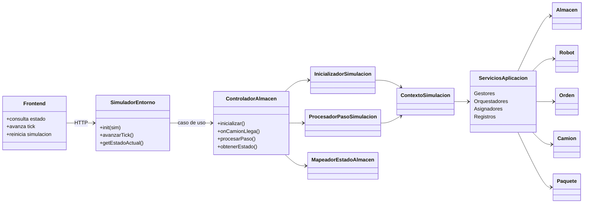
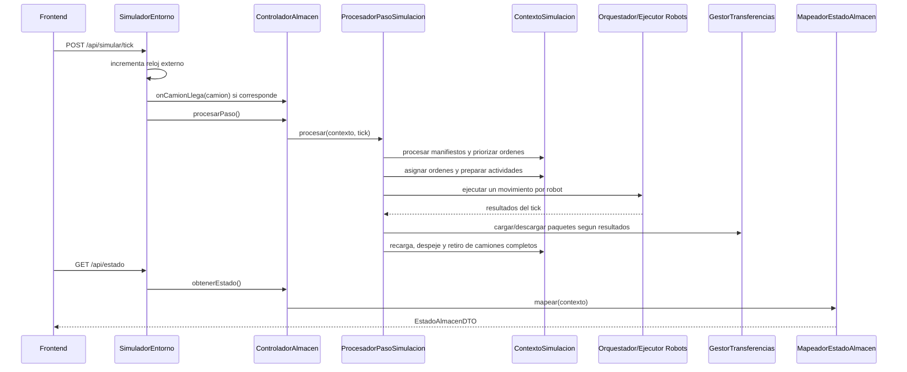
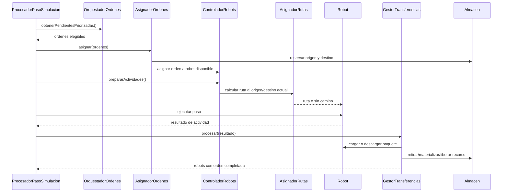

# Guia para la presentacion final

## Idea central

No nos limitamos a hacer que la simulacion avance. El trabajo principal fue
transformar una especificacion con muchas reglas en un diseno mantenible:
separamos responsabilidades, dejamos las entidades con comportamiento propio y
movimos las decisiones globales a servicios de aplicacion.

La frase guia para la presentacion puede ser:

> Partimos de un modelo conceptual de almacen, robots, paquetes, camiones y
> ordenes. La implementacion final conserva esos conceptos, pero los organiza
> con capas, servicios y contratos para evitar clases enormes y estados
> dificiles de controlar.

## Que hicimos nosotros

### Del modelo conceptual al codigo

| Concepto del modelo | Implementacion actual | Que conviene destacar |
|---|---|---|
| Almacen | `Almacen` | Representa la topologia y la ocupacion fisica de celdas. No administra robots. |
| Celda | `Celda`, `Estanteria`, `Muelle`, `BaseCarga`, `Pasillo` | Cada tipo tiene reglas propias. Solo estanterias y muelles son reservables. |
| Robot | `Robot` | Sabe moverse, gastar/recargar bateria y transportar paquetes, pero no decide ordenes ni coordina el sistema. |
| Flota | `RegistroRobots`, `ControladorRobots` | La flota y las transiciones operativas quedan fuera de `Almacen` y fuera de `Robot`. |
| Camion | `Camion`, `GestorCamiones` | El camion conserva sus manifiestos; el gestor maneja acople, desacople y colas FIFO. |
| Orden | `Orden`, `RegistroOrdenes`, `OrquestadorOrdenes`, `AsignadorOrdenes` | La orden mantiene su estado; la elegibilidad, prioridad y asignacion quedan separadas. |
| Paquete | `Paquete`, `PaqueteGeneral`, `PaqueteComestible`, `GestorPaquetes` | Los paquetes se crean y materializan en un servicio especializado. |
| Ruta | `CalculadorRutas`, `MovimientoL`, `AStar`, `ResultadoCalculoRuta` | La navegacion es intercambiable y una ruta imposible no se confunde con estar en destino. |
| Estado para la UI | `MapeadorEstadoAlmacen`, DTOs | El frontend recibe snapshots sin conocer las entidades internas. |

Que decir:

- El modelo conceptual nos dio los sustantivos principales.
- El codigo final separa esos sustantivos segun responsabilidad real.
- Varias clases no aparecen como "cosas del dominio", sino como fabricaciones
  puras para bajar acoplamiento: gestores, registros, asignadores, mapeadores y
  orquestadores.

### Evolucion del diseno

En una primera version era muy facil caer en clases que "sabian demasiado":

- Un controlador que construia, ejecutaba ticks y armaba la respuesta.
- Un almacen que tambien conocia robots.
- Un robot que podia terminar coordinando ordenes, recarga, despeje y paquete.
- Un gestor de camiones que tambien creaba ordenes.
- Rutas con respuestas ambiguas, por ejemplo una lista vacia podia significar
  "ya llegue" o "no hay camino".

La version actual ataca esos problemas asi:

- `ControladorAlmacen` queda como fachada estable.
- `InicializadorSimulacion` crea el contexto completo.
- `ProcesadorPasoSimulacion` define el orden del tick.
- `MapeadorEstadoAlmacen` arma el snapshot para la interfaz.
- `ControladorRobots` concentra la actividad operativa del robot sin ensuciar la
  entidad `Robot`.
- `AsignadorOrdenes` realiza reservas con rollback si la asignacion falla.
- `GestorTransferencias` coordina carga y descarga sin mezclarlo con movimiento.

La idea importante: no solo dividimos archivos, dividimos motivos de cambio.

## Arquitectura actual

Que mostrar:

- El frontend no toca entidades de dominio: consume DTOs.
- `SimuladorEntorno` representa el mundo externo: reloj, CSV y llegada de
  camiones.
- `ControladorAlmacen` es el punto de entrada estable.
- Las entidades no coordinan todo el sistema; colaboran con servicios.

## Patrones de diseno aplicados

### Facade

`ControladorAlmacen` es la fachada del sistema de almacen.

Que resuelve:

- El entorno no necesita conocer todos los gestores internos.
- La API publica queda chica: inicializar, recibir camion, procesar paso y pedir
  estado.
- Permite cambiar la organizacion interna sin cambiar el contrato usado por
  `SimuladorEntorno`.

### Builder

`AlmacenBuilder` construye almacenes validos.

Que resuelve:

- Evita crear un almacen incompleto.
- Centraliza validaciones estructurales: dimensiones, bases, muelles,
  estanterias, posiciones invalidas y superposiciones.
- Aplica tambien Creator: quien tiene los datos de construccion crea el objeto.

### Strategy

La navegacion se modela con estrategias como `MovimientoL` y `AStar`, usadas por
`CalculadorRutas`.

Que resuelve:

- Permite cambiar la forma de calcular rutas sin modificar al robot.
- El robot solo recibe una ruta, no sabe como fue calculada.
- Cuando un robot se bloquea repetidamente, el sistema puede alternar estrategia.

Tambien puede mencionarse la priorizacion de ordenes como decision variable:
FEFO y peso quedan encapsulados fuera del controlador.

### DTO / Mapper

Los contratos viven en `application/contracts` y el estado se proyecta con
`MapeadorEstadoAlmacen`.

Que resuelve:

- El frontend no depende de clases internas.
- Los CSV y la API no contaminan el dominio.
- El snapshot de estado se puede adaptar sin exponer referencias reales como
  `Camion`, `Orden` o `Paquete`.

### Factory / Creator

`FabricaDominio`, `GestorPaquetes` y `ProcesadorManifiestos` crean objetos a
partir de datos externos o eventos.

Que resuelve:

- La creacion de camiones, paquetes y ordenes no queda desperdigada.
- Las entidades no tienen que conocer formatos CSV ni DTOs.

### Registry

`RegistroRobots` y `RegistroOrdenes` funcionan como registros internos.

Que resuelve:

- Separan identidad y busqueda de entidades.
- Evitan que `Almacen` se convierta en una bolsa global de todo el sistema.

### Observer

`SimuladorEntorno` implementa `TickSubject` y `LoggerObserver` recibe
notificaciones de ticks.

Que resuelve:

- La simulacion puede notificar eventos externos sin acoplarse al logger.
- El observer se usa afuera del nucleo del tick, para no mezclarlo con la logica
  principal de robots y ordenes.

## GRASP aplicado

| Principio GRASP | Donde aparece | Como explicarlo |
|---|---|---|
| Controller | `ControladorAlmacen`, `ProcesadorPasoSimulacion`, `ControladorRobots` | Reciben eventos del sistema y coordinan casos de uso sin hacer todo ellos mismos. |
| Information Expert | `Celda` para ocupacion, `Robot` para movimiento/bateria, `Estanteria` para paquete, `Muelle` para acople | La informacion se modifica donde vive naturalmente. |
| Creator | `AlmacenBuilder`, `FabricaDominio`, `GestorPaquetes`, `ProcesadorManifiestos` | Crean objetos quienes tienen los datos necesarios para hacerlo bien. |
| Pure Fabrication | Gestores, registros, mapeadores, asignadores y orquestadores | Son clases que no salen del modelo conceptual, pero mejoran cohesion y acoplamiento. |
| Low Coupling | DTOs, estrategias, servicios por responsabilidad | El frontend, CSV, rutas y dominio no se conocen directamente entre si. |
| High Cohesion | Cada gestor tiene un caso de uso acotado | Camiones, robots, ordenes, paquetes y transferencias evolucionan separados. |
| Indirection | `OrquestadorRobots`, `GestorTransferencias`, `MapeadorEstadoAlmacen` | Intermedian entre objetos para que las entidades no acumulen dependencias. |
| Protected Variations | Contratos, DTOs y estrategias | Cambios en UI, CSV o algoritmo de rutas quedan contenidos. |

Punto para remarcar:

- GRASP nos sirvio como criterio para decidir "donde va esta responsabilidad".
- SOLID nos sirvio como criterio para revisar si esa distribucion era sostenible.

## SOLID aplicado

### SRP - Single Responsibility Principle

Ejemplos claros:

- `ControladorAlmacen` ya no construye, procesa y mapea a la vez.
- `GestorCamiones` no crea ordenes; eso queda en `ProcesadorManifiestos`.
- `Robot` no decide asignaciones ni recargas; ejecuta comportamiento fisico.
- `MapeadorEstadoAlmacen` solo convierte dominio a DTO.

Como decirlo:

- "Intentamos que cada clase tenga un motivo principal de cambio."

### OCP - Open/Closed Principle

Ejemplos:

- Se pueden agregar estrategias de ruta sin tocar `Robot`.
- Se puede cambiar la politica de priorizacion sin reescribir el controlador.

Como decirlo:

- "Las decisiones variables quedaron encapsuladas en estrategias o servicios,
  para extender sin meter condiciones nuevas en todos lados."

### LSP - Liskov Substitution Principle

Ejemplo:

- `BaseCarga` dejo de comportarse como reservable porque no respetaba la misma
  semantica que `Estanteria` y `Muelle`.

Como decirlo:

- "Preferimos sacar una capacidad antes que prometer metodos que no tenian
  sentido para ese subtipo."

### ISP - Interface Segregation Principle

Ejemplos:

- Contratos chicos para estrategia de ruta, contexto de movimiento y observers.
- El frontend consume DTOs, no una interfaz enorme del dominio.

Como decirlo:

- "Cada consumidor recibe el contrato minimo que necesita."

### DIP - Dependency Inversion Principle

Ejemplos:

- Aplicacion depende de contratos propios, no de DTOs de infraestructura.
- Las estrategias de navegacion se usan mediante abstracciones.

Como decirlo:

- "Las capas internas no dependen del formato del CSV ni de la UI."

## Secuencia 1: avance de un tick

Que remarcar:

- Un tick tiene orden definido y determinista.
- Asignar o calcular rutas no es lo mismo que moverse fisicamente.
- Cada robot ejecuta como maximo una actividad fisica por tick.
- El estado que ve la UI es una proyeccion, no el dominio real.

## Secuencia 2: asignacion y movimiento de un paquete

Que remarcar:

- La reserva evita que dos robots tomen el mismo origen/destino operativo.
- Si una asignacion falla, se revierte para no dejar recursos tomados a medias.
- La transferencia de paquete esta separada del movimiento del robot.
- Recepcion y despacho comparten estructura, pero cambian origen/destino y tipo
  de transferencia.

## Que cambio respecto de la especificacion original

### Se mantuvo

- Simulacion por ticks.
- Entrada por CSV.
- Robots con posicion, bateria, carga y estados operativos.
- Ordenes de recepcion y despacho.
- Camiones asociados a muelles.
- Priorizacion de ordenes.
- Interfaz grafica con tablero, robots, ordenes, camiones y avance manual o
  automatico.

### Se simplifico o acoto

- No agregamos persistencia externa ni base de datos; el estado vive en memoria.
- La simulacion corre de forma sincronica mediante endpoints.
- La bateria preventiva usa distancia Manhattan como estimacion.
- No modelamos State con una clase por estado; usamos enum publico y contexto
  operativo controlado.
- Las bases de carga no se reservan: la ocupacion fisica decide si el robot
  puede entrar.

### Se ajusto por diseno

- `BaseCarga` dejo de ser reservable para respetar mejor LSP.
- El observer no dirige el tick interno; queda como notificacion externa.
- Los DTOs se separaron de infraestructura para que aplicacion no dependa del
  CSV ni de Express.
- Las rutas tienen un resultado discriminado: `EN_DESTINO`, `RUTA` o
  `SIN_CAMINO`.
- El controlador se conservo como contrato publico, pero su implementacion se
  partio en inicializador, procesador y mapper.

### Como responder si preguntan por limites

- "Hay decisiones intencionales de alcance: memoria en vez de base de datos,
  simulacion sincronica y CSV como fuente externa."
- "La parte fuerte del trabajo fue que esas decisiones quedaron aisladas. Si
  cambiara el origen de datos o el algoritmo de ruta, no deberia reescribirse el
  dominio completo."

## Guia de demo con CSV en vivo

### Antes de mostrar

- Tener backend y frontend levantados.
- Verificar que `sim1` o `sim2` cargan correctamente.
- Tener visible la carpeta `backend/data`, porque las simulaciones disponibles
  salen de sus subcarpetas.

### Que mostrar primero

- Selector de simulacion.
- Botones de reiniciar, avanzar tick y auto-play.
- Tablero central con robots, estanterias, muelles y bases.
- Paneles laterales de ordenes/robots/camiones.

### Flujo sugerido

1. Seleccionar una simulacion existente.
2. Reiniciar para empezar desde tick 0.
3. Avanzar manualmente algunos ticks.
4. Mostrar que llegan camiones, aparecen ordenes y se asignan robots.
5. Activar auto-play para ver movimiento continuo.
6. Pausar y mostrar el detalle de un robot: estado, bateria, orden y paquete.
7. Mostrar una orden completada y el cambio en camion/paquete.

### Para el CSV que den en vivo

- Crear una nueva subcarpeta dentro de `backend/data`, por ejemplo
  `backend/data/demo-docente`.
- Colocar los tres archivos esperados: `almacen.csv`, `camiones.csv` y
  `ordenes.csv`.
- Recargar la pagina para que el frontend vuelva a pedir `/api/simulaciones`.
- Elegir la nueva simulacion en el selector.
- Usar reiniciar si hace falta para cargarla desde tick 0.

Que conviene decir:

- "El backend descubre simulaciones por carpeta."
- "El CSV no entra al dominio directamente: lo lee infraestructura y se
  transforma a DTOs/objetos mediante la capa de aplicacion."
- "La UI solo consume el estado publicado, por eso no queda acoplada a como se
  parsea el CSV."

## Preguntas probables y respuestas cortas

### Donde aplicaron GRASP de forma mas clara?

En la distribucion de responsabilidades. `Robot` es experto en movimiento y
bateria, `Celda` en ocupacion, `Muelle` en acople, y las decisiones que no
pertenecen naturalmente a una entidad se movieron a fabricaciones puras como
gestores, asignadores y mapeadores.

### Cual fue el patron mas importante?

Facade en `ControladorAlmacen`, porque mantuvo estable el contrato externo
mientras pudimos refactorizar el interior. Tambien Strategy fue importante para
desacoplar la navegacion del robot.

### Por que no hicieron una clase por estado del robot?

Porque para este alcance el enum de estado mas `ControladorRobots` mantiene las
transiciones claras sin multiplicar clases. La decision fue privilegiar cohesion
y simplicidad. Si el comportamiento por estado creciera mucho, ahi si tendria
sentido evaluar State.

### Como evitan que dos robots tomen el mismo paquete o recurso?

La asignacion reserva origen y destino sobre recursos reservables, y si algo
falla se revierte. Ademas la ocupacion fisica de celdas evita superposiciones
durante el movimiento.

### Que pasa si un robot se bloquea?

El robot conserva la ruta y espera sin consumir bateria. Luego de bloqueos
repetidos, el sistema cambia la estrategia de ruta y recalcula.

### Que pasa con bateria baja?

Antes de asignar o continuar actividades se estima si el robot puede completar
la tarea y llegar a una base. Si no puede, se lo deriva a recarga o se informa
un error de dominio si la situacion es irrecuperable.

### Que parte del contrato tuvieron que cuidar mas?

El estado consumido por la interfaz. Por eso existe `MapeadorEstadoAlmacen`: el
dominio puede cambiar internamente, pero el frontend sigue recibiendo un DTO
estable.

### Que quedo como mejora futura?

- Validaciones mas explicitas de CSV antes de iniciar.
- Generar tipos compartidos entre backend y frontend.
- Indices para inventario si creciera mucho el volumen.
- Una transaccion global por tick si el sistema necesitara recuperarse de
  errores parciales en medio del paso.

## Cierre sugerido

La conclusion no deberia ser "tenemos muchas clases", sino:

- Las clases representan responsabilidades separadas.
- Los patrones no se aplicaron por decorar el codigo, sino para resolver
  problemas concretos de acoplamiento, creacion, extension y presentacion.
- GRASP nos ayudo a ubicar responsabilidades.
- SOLID nos ayudo a revisar que esas responsabilidades no quedaran rigidas.
- La demo con CSV muestra que la arquitectura soporta cambiar datos de entrada
  sin tocar el dominio ni la interfaz.

